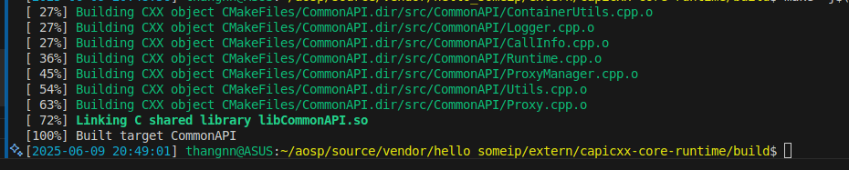
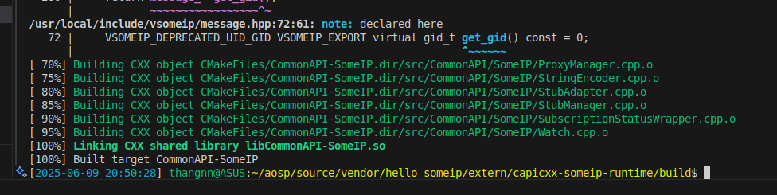
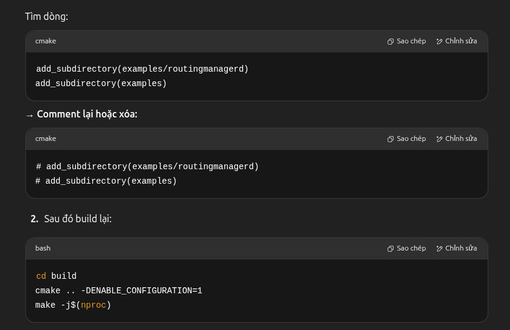
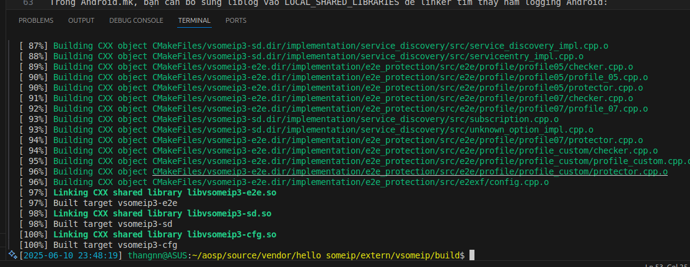
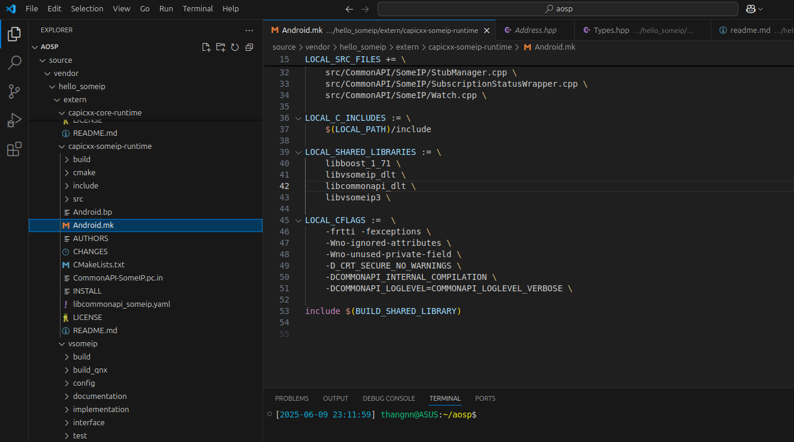
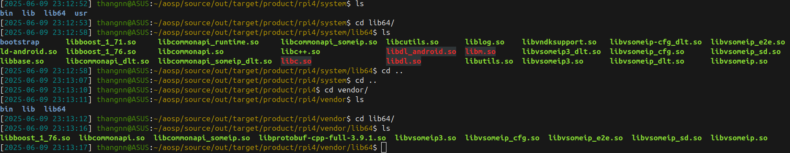
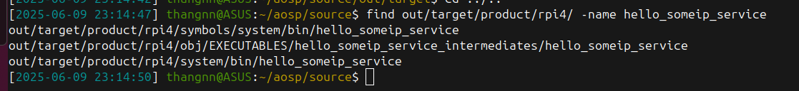
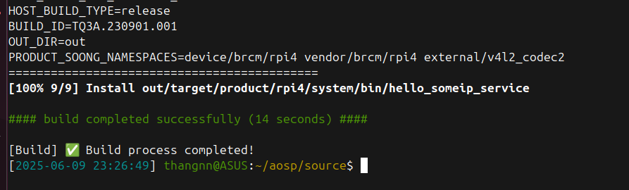
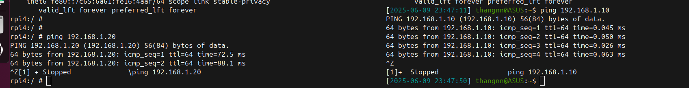

vendor/
└── myvendor/
    ├── common/
    │   └── HelloWorld.fidl
    ├── service/
    │   ├── Android.bp
    │   ├── HelloWorldStubImpl.cpp
    │   ├── main.cpp
    │   └── vsomeip.json
    └── client/
        ├── CMakeLists.txt
        ├── HelloWorldClient.cpp
        └── main.cpp

commonapi-generator -sk ./HelloWorld.fidl -d ./gen
commonapi-someip-generator -sk ./HelloWorld.fidl -d ./gen

Phu thuoc ca boost

B1: Build capicxx-core-runtime
B2: Build capicxx-someip-runtime
B3: Build vsomeip

B4: Build service

// Phai build core truoc
cd ~/aosp/source/vendor/someip_service/extern/capicxx-core-runtime
mkdir -p build && cd build
cmake ..
make -j$(nproc)
sudo make install

// Sau do moi chay cai nay
cd ../capicxx-someip-runtime
mkdir -p build && cd build
cmake ..
make -j$(nproc)
sudo make install

// Build vsomeip, bat config de load duoc file json
cmake .. -DENABLE_CONFIGURATION=1
make -j$(nproc)

Bug
1. Comment LoggerImpl.cpp
FAILED: ninja: 'vendor/hello_someip/extern/capicxx-core-runtime/src/CommonAPI/LoggerImpl.cpp', needed by 'out/target/product/rpi4/obj/SHARED_LIBRARIES/libcommonapi_dlt_intermediates/sr
c/CommonAPI/LoggerImpl.o', missing and no known rule to make it
21:09:12 ninja failed with: exit status 1

2.

Trong Android.mk, bạn cần bổ sung liblog vào LOCAL_SHARED_LIBRARIES để linker tìm thấy hàm logging Android:

makefile
Sao chép
Chỉnh sửa
LOCAL_SHARED_LIBRARIES := \
    libboost_1_71 \
    liblog

[2025-06-09 21:49:51] thangnn@ASUS:~/aosp/source/out$ find . -name "libcommonapi_someip_dlt.so"
./target/product/rpi4/symbols/system/lib/libcommonapi_someip_dlt.so
./target/product/rpi4/symbols/system/lib64/libcommonapi_someip_dlt.so
./target/product/rpi4/obj/SHARED_LIBRARIES/libcommonapi_someip_dlt_intermediates/libcommonapi_someip_dlt.so
./target/product/rpi4/obj_arm/SHARED_LIBRARIES/libcommonapi_someip_dlt_intermediates/LINKED/libcommonapi_someip_dlt.so
./target/product/rpi4/obj_arm/SHARED_LIBRARIES/libcommonapi_someip_dlt_intermediates/libcommonapi_someip_dlt.so
./target/product/rpi4/system/lib/libcommonapi_someip_dlt.so
./target/product/rpi4/system/lib64/libcommonapi_someip_dlt.so
[2025-06-09 21:49:53] thangnn@ASUS:~/aosp/source/out$ 
[2025-06-09 21:50:15] thangnn@ASUS:~/aosp/source/out$ 
[2025-06-09 21:50:15] thangnn@ASUS:~/aosp/source/out$ readelf -d ./target/product/rpi4/system/lib/libcommonapi_someip_dlt.so | grep NEEDED
 0x00000001 (NEEDED)                     Shared library: [libboost_1_76.so]
 0x00000001 (NEEDED)                     Shared library: [libvsomeip_dlt.so]
 0x00000001 (NEEDED)                     Shared library: [libcommonapi_dlt.so]
 0x00000001 (NEEDED)                     Shared library: [libvsomeip3_dlt.so]
 0x00000001 (NEEDED)                     Shared library: [libc++.so]
 0x00000001 (NEEDED)                     Shared library: [libc.so]
 0x00000001 (NEEDED)                     Shared library: [libm.so]
 0x00000001 (NEEDED)                     Shared library: [libdl.so]
[2025-06-09 21:50:17] thangnn@ASUS:~/aosp/source/out$ 

3.
LOCAL_MODULE := libcommonapi_dlt
LOCAL_MODULE_TAGS := optional
LOCAL_CLANG := true
LOCAL_PROPRIETARY_MODULE := false
LOCAL_EXPORT_C_INCLUDE_DIRS := $(LOCAL_PATH)/include \

LOCAL_SRC_FILES += \
    src/CommonAPI/Address.cpp \
    src/CommonAPI/CallInfo.cpp \ <-
    src/CommonAPI/ContainerUtils.cpp \
    src/CommonAPI/IniFileReader.cpp \
    src/CommonAPI/Logger.cpp \
    src/CommonAPI/MainLoopContext.cpp \
    src/CommonAPI/Proxy.cpp \
    src/CommonAPI/ProxyManager.cpp \
    src/CommonAPI/Runtime.cpp \
    src/CommonAPI/Utils.cpp \

[2025-06-09 22:59:06] thangnn@ASUS:~/aosp/source$ find vendor/hello_someip/extern/ -name Logger.hpp
find vendor/hello_someip/extern/ -name Export.hpp
vendor/hello_someip/extern/capicxx-core-runtime/include/CommonAPI/Logger.hpp
vendor/hello_someip/extern/capicxx-core-runtime/include/CommonAPI/Export.hpp
[2025-06-09 22:59:08] thangnn@ASUS:~/aosp/source$ 

adb push vsomeip_service.rc /vendor/etc/init/

// Client

[2025-06-09 23:22:44] thangnn@ASUS:~/aosp/source/vendor/hello_someip/client$ make
g++ -std=c++17 -I/usr/local/include -Wall HelloWorldClient.cpp main_client.cpp -o client_someip -L/usr/local/lib -lvsomeip3 -lpthread
[2025-06-09 23:22:48] thangnn@ASUS:~/aosp/source/vendor/hello_someip/client$ ls -l
total 84
-rwxrwxr-x 1 thangnn thangnn 65184 Jun  9 23:22 client_someip <--------------------
-rwxr-xr-x 1 thangnn thangnn  1375 Jun  9 19:20 HelloWorldClient.cpp
-rw-rw-r-- 1 thangnn thangnn   323 Jun  9 19:19 HelloWorldClient.hpp
-rwxr-xr-x 1 thangnn thangnn   415 Jun  9 19:20 main_client.cpp
-rw-rw-r-- 1 thangnn thangnn   258 Jun  9 23:22 Makefile
-rwxr-xr-x 1 thangnn thangnn   420 Jun  9 17:52 vsomeip-client.json
[2025-06-09 23:22:52] thangnn@ASUS:~/aosp/source/vendor/hello_someip/client$ 

ip addr add 192.168.1.10/24 dev eth0; ip link set eth0 up; ip a show eth0

rpi4:/ # ip addr add 192.168.1.10/24 dev eth0
rpi4:/ # ip link set eth0 up
rpi4:/ # ip a show eth0
3: eth0: <BROADCAST,MULTICAST,UP,LOWER_UP> mtu 1500 qdisc mq state UP group default qlen 1000
    link/ether d8:3a:dd:50:c8:57 brd ff:ff:ff:ff:ff:ff
    inet 192.168.1.10/24 scope global eth0
       valid_lft forever preferred_lft forever
    inet6 fe80::7c65:6a61:fe16:4aaf/64 scope link stable-privacy 
       valid_lft forever preferred_lft forever
rpi4:/ # 

sudo ip addr add 192.168.1.20/24 dev enp4s0; sudo ip link set enp4s0 up; ip a show enp4s0

[2025-06-09 23:46:47] thangnn@ASUS:~$ sudo ip addr add 192.168.1.20/24 dev enp4s0
[sudo] password for thangnn: 
[2025-06-09 23:46:50] thangnn@ASUS:~$ sudo ip link set enp4s0 up
[2025-06-09 23:47:02] thangnn@ASUS:~$ ip a show enp4s0
2: enp4s0: <BROADCAST,MULTICAST,UP,LOWER_UP> mtu 1500 qdisc fq_codel state UP group default qlen 1000
    link/ether fc:34:97:dd:e6:bc brd ff:ff:ff:ff:ff:ff
    inet 192.168.1.20/24 scope global enp4s0
       valid_lft forever preferred_lft forever
[2025-06-09 23:47:11] thangnn@ASUS:~$ 

adb push ~/vf6/out/target/product/vf_generic/vendor/lib64/libvsomeip_cfg.so /vendor/lib64/
adb push ~/vf6/out/target/product/vf_generic/vendor/lib64/libvsomeip3.so /vendor/lib64/
adb push ~/vf6/out/target/product/vf_generic/vendor/lib64/libvsomeip3.so /vendor/lib64/
adb push ~/vf6/out/target/product/vf_generic/vendor/lib64/libvsomeip_sd.so /vendor/lib64/
adb push ~/vf6/out/target/product/vf_generic/vendor/lib64/libcommonapi_someip.so /vendor/lib64/
adb push ~/vf6/out/target/product/vf_generic/vendor/lib64/libcommonapi.so /vendor/lib64/
adb push ~/vf6/out/target/product/vf_generic/vendor/lib64/libboost_1_71.so /vendor/lib64/

adb push vsomeip-server.json /vendor/etc/

./target/product/rpi4/symbols/system/bin/hello_someip_service
adb push hello_someip_service /system/bin

export LD_LIBRARY_PATH=$LD_LIBRARY_PATH:/vendor/lib64
export VSOMEIP_CONFIGURATION=/vendor/etc/vsomeip-server.json
/system/bin/hello_someip_service

./target/product/rpi4/vendor/lib64/libvsomeip_cfg.so
./target/product/rpi4/vendor/lib64/libvsomeip3.so
./target/product/rpi4/vendor/lib64/libvsomeip_sd.so
./target/product/rpi4/vendor/lib64/libcommonapi_someip.so
./target/product/rpi4/vendor/lib64/libcommonapi.so
./target/product/rpi4/symbols/system/lib64/libboost_1_71.so
./target/product/rpi4/vendor/lib64/libboost_1_76.so

adb push -> /vendor/lib64

adb push vsomeip-server.json /vendor/etc

export LD_LIBRARY_PATH=$LD_LIBRARY_PATH:/vendor/lib64
export VSOMEIP_CONFIGURATION=/vendor/etc/vsomeip-server.json
/system/bin/hello_someip_service

LD_LIBRARY_PATH=$LD_LIBRARY_PATH:/vendor/lib64 VSOMEIP_CONFIGURATION=/vendor/etc/vsomeip-server.json /system/bin/hello_someip_service

VSOMEIP_CONFIGURATION=./vsomeip-client.json VSOMEIP_APPLICATION_NAME=hello_someip_client ./hello_someip_client
